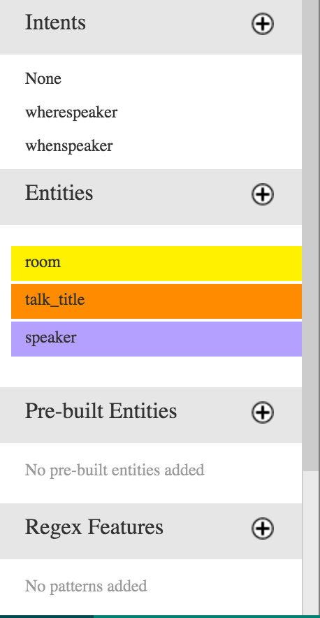
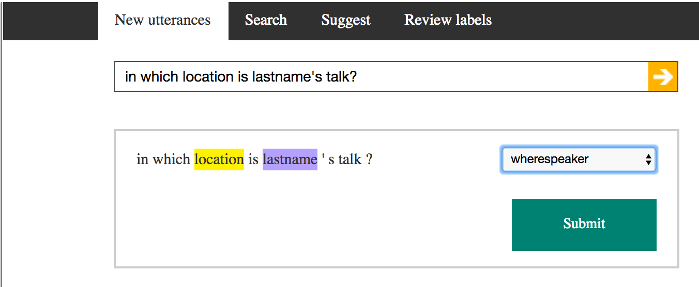

# Lab:  Setup LUIS Model

This LUIS model is going to be consumed by a Bot built with the Microsoft Bot Framework.  This model is meant to capture the intents of a user who is finding out information about a conference (e.g. "what time is Sally Mason speaking?" or "When is the Data Science with Python talk?").

## Instructions

1.  Login into https://www.luis.ai (you may have to create an account)
2.  Click on "+New App" and "New Application"
3.  Fill out the form (Application usage scenario is "Bot")
4. Enter the following Entities
  * room
  * talk_title
  * speaker
* Add the following Intents
  * wherespeaker
  * whenspeaker

  You May add these as well if you wish...
  
  * wheretitle
  * whentitle
  * nextspeakers
  * nexttalks

  Your model will look something like:
  
  
* Enter 5 example utterences for each intent attempting to reflect all of the entities as well (you will need to label the entities by highlighting parts of the utterence AND selecting a label before submitting it).

  Labeling looks like:
  
  
7.  Click on "Train" in the lower lefthand corner
8.  Click on "App Settings" in the upper lefthand corner and make a note of
  * App Id
  * Endpoint key (you probably need to create one so go ahead)

Congratulations!  Enjoy your new language model!

Good Docs are found through the link "Help Docs" in the navi bar.